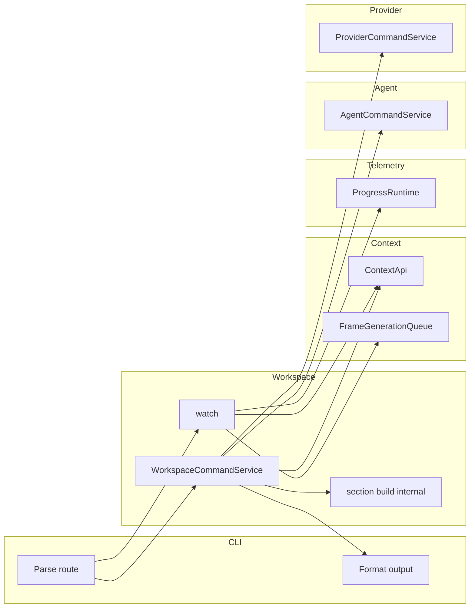

# Phase 8 — Workspace Command, Status, and Watch Ownership

Date: 2026-02-21

## Goal and dependencies

**Goal:** Move workspace command orchestration, status assembly, and watch runtime into the workspace domain; align with the agent/provider command pattern; complete cross-domain hook integration.

**Dependencies:** Phase 4 (config composition, path contracts), Phase 5 (telemetry contracts), Phase 6 (context queue/generation contracts), Phase 7 (provider/agent command services, adapter cutover).

**Key docs:**

- [workspace/workspace_migration_guide.md](workspace/workspace_migration_guide.md)
- [workspace_lifecycle_services.md](workspace/workspace_lifecycle_services.md)
- [workspace_watch_runtime_spec.md](workspace/workspace_watch_runtime_spec.md)
- [tooling_diffusion_map.md](cli/tooling_diffusion_map.md)

---

## Command pattern alignment

Workspace follows the same structure as agent and provider:

- **Command enum** in CLI: `WorkspaceCommands` (Status, Validate, Ignore, Delete, Restore, Compact, ListDeleted).
- **Single command service** in the domain: `WorkspaceCommandService` in `src/workspace/commands.rs` with one method per variant. No `run_` prefix (matches agent; method name is the outcome).
- **One service call per variant** from CLI; CLI only parses, dispatches, and formats.

| Domain   | Service                  | Methods (examples)                                                                 |
| -------- | ------------------------ | --------------------------------------------------------------------------------- |
| Agent    | AgentCommandService      | list, show, status, validate_single, validate_all, create, remove                  |
| Provider | ProviderCommandService   | run_list, run_show, run_status, run_validate, run_test, run_create, run_remove    |
| Workspace| WorkspaceCommandService  | status, validate, ignore, delete, restore, compact, list_deleted, unified_status  |

`unified_status` is the fan-in for `merkle status`: workspace calls `status` (workspace section), `AgentCommandService::status`, and `ProviderCommandService::run_status`, then assembles `UnifiedStatusOutput`.

---

## Current state (verified in codebase)

- **No `src/workspace/` domain.** Workspace logic is split across:
  - [src/workspace_status.rs](../src/workspace_status.rs): `build_workspace_status`, `WorkspaceStatus`, `TreeStatus`, `PathCount`, `ContextCoverageEntry`, agent/provider status types, `UnifiedStatusOutput`, and `format_*_text`.
  - [src/tooling/cli.rs](../src/tooling/cli.rs): `run_workspace_validate`, `run_workspace_ignore`, `run_workspace_delete`, `run_workspace_restore`, `run_workspace_compact`, `run_workspace_list_deleted`; `resolve_workspace_node_id` and `resolve_node_id_by_canonical_fallback`; watch command setup; `handle_unified_status` (builds workspace section and agent/provider sections by iterating registries instead of using command services).
  - [src/tooling/watch.rs](../src/tooling/watch.rs): `WatchConfig`, `ChangeEvent`, `EventBatcher`, `WatchDaemon` and runtime logic; depends on `ContextApi`, `context::queue::FrameGenerationQueue`, `telemetry::ProgressRuntime`.
  - [src/tooling/editor.rs](../src/tooling/editor.rs): `EditorHooks`; depends on `ContextApi`.

- Watch already uses context queue and telemetry contracts; lifecycle/status use `ContextApi`, `ignore::*`, and `tree::TreeBuilder`. Agent and provider expose `AgentCommandService::status` and `ProviderCommandService::run_status` for unified status fan-in.

---

## Target architecture

WorkspaceCommandService consumes agent and provider only for `unified_status` (workspace calls agent/provider; agent and provider do not depend on workspace).

---

## Task list

### 1. Workspace domain root and facade

- Add [src/workspace.rs](../src/workspace.rs): declare `mod commands`, `mod types`, `mod watch`, and optionally `mod section`; re-export facade. No `mod lifecycle` or `mod status`; no `mod.rs` (use parent.rs + parent/child.rs per AGENTS.md).
- Add [src/workspace/facade.rs](../src/workspace/facade.rs): re-export `WorkspaceCommandService`, result types, and watch types so CLI and tests depend on `crate::workspace` only.
- Add [src/workspace/types.rs](../src/workspace/types.rs): shared types used by commands (or keep DTOs in commands.rs; types.rs for cross-cutting types if any).
- Register `pub mod workspace` in [src/lib.rs](../src/lib.rs).
- Run Phase 1 gates and `cargo build`; no behavior change yet.

### 2. Workspace command service extraction

- Add [src/workspace/commands.rs](../src/workspace/commands.rs). Define `WorkspaceCommandService` (stateless) with one method per `WorkspaceCommands` variant (no `run_` prefix):
  - `status` — workspace section only (tree, context coverage, top paths); for `WorkspaceCommands::Status`.
  - `validate` — validate store/head index/root.
  - `ignore` — list or add ignore list.
  - `delete` — tombstone node/subtree, optional ignore update.
  - `restore` — restore tombstoned node/subtree, remove from ignore.
  - `compact` — purge old tombstones (and optionally frames).
  - `list_deleted` — list tombstoned nodes with optional age filter.
  - `unified_status` — fan-in workspace + agent + provider (calls `status`, `AgentCommandService::status`, `ProviderCommandService::run_status`); returns `UnifiedStatusOutput` for `merkle status`.
- Move `resolve_workspace_node_id` and `resolve_node_id_by_canonical_fallback` from [src/tooling/cli.rs](../src/tooling/cli.rs) into workspace (e.g. in commands.rs or [src/workspace/section.rs](../src/workspace/section.rs) or a resolve helper module). Use from `delete` and `restore`.
- Implement each operation by moving logic from the current `run_workspace_*` implementations in cli.rs: same use of `ignore::*`, `api.node_store()`, `api.head_index()`, `api.tombstone_node()`, `api.restore_node()`, `api.compact()`, `TreeBuilder`, and frame-count logic. Service returns DTOs; CLI formats to text/json.
- Workspace section build (current `build_workspace_status`): implement as a private function or in optional [src/workspace/section.rs](../src/workspace/section.rs), used by `status` and `unified_status`. Move `WorkspaceStatus`, `TreeStatus`, `PathCount`, `ContextCoverageEntry` into workspace (commands.rs or section.rs or types.rs).
- Wire CLI: for each `WorkspaceCommands` variant, CLI calls `WorkspaceCommandService::<method>` once, then formats. Remove old `run_workspace_*` bodies and replace with delegation to `crate::workspace::*`.

### 3. Unified status and formatting

- `unified_status` on `WorkspaceCommandService` builds workspace section (via internal `status`/section build), calls `AgentCommandService::status(agent_registry)` and `ProviderCommandService::run_status(provider_registry, test_connectivity)`, maps to existing output shapes, and returns `UnifiedStatusOutput`.
- Move `UnifiedStatusOutput` and `format_*_text` (workspace, agent, provider, unified) into workspace (e.g. commands.rs or [src/workspace/format.rs](../src/workspace/format.rs)) so CLI calls workspace for build and format. Slim or remove [src/workspace_status.rs](../src/workspace_status.rs) in task 7.
- For `handle_unified_status` in CLI: replace inline assembly with a single call to `WorkspaceCommandService::unified_status(...)`, then format.

### 4. Watch events and editor bridge extraction

- Add [src/workspace/watch.rs](../src/workspace/watch.rs): parent file declaring `mod events; mod editor_bridge; mod runtime;` and re-exporting public types (no `mod.rs`).
- Add [src/workspace/watch/events.rs](../src/workspace/watch/events.rs): move `ChangeEvent` and `EventBatcher` from tooling/watch.rs; move `WatchConfig` here or to runtime.
- Add [src/workspace/watch/editor_bridge.rs](../src/workspace/watch/editor_bridge.rs): move `EditorHooks` from tooling/editor.rs (same API).

### 5. Watch runtime extraction and hook routing

- Add [src/workspace/watch/runtime.rs](../src/workspace/watch/runtime.rs): move `WatchDaemon` and all its methods from tooling/watch.rs. Keep dependencies on `ContextApi`, `context::queue::FrameGenerationQueue`, `telemetry::ProgressRuntime`, and other existing types. Route watch queue hooks through context contracts and telemetry hooks through telemetry contracts (no new wiring).
- In [src/workspace/watch.rs](../src/workspace/watch.rs), re-export `WatchDaemon`, `WatchConfig`, `ChangeEvent`, and any type needed by CLI.
- CLI watch command: use `crate::workspace::watch::{WatchConfig, WatchDaemon}` (or facade re-export); build config and start daemon from workspace.

### 6. Status fan-in

- Implemented by `WorkspaceCommandService::unified_status`: workspace calls agent and provider command services and assembles `UnifiedStatusOutput`. No inline assembly in CLI.
- `WorkspaceCommands::Status` uses `WorkspaceCommandService::status` (workspace section only).

### 7. Legacy removal and boundary seal

- Remove from [src/tooling/cli.rs](../src/tooling/cli.rs): all `run_workspace_*` implementations and the moved helpers. Keep only route dispatch and formatting that delegate to workspace.
- Remove or slim [src/workspace_status.rs](../src/workspace_status.rs): remove types and build moved to workspace; move remaining formatters to workspace and remove file, or keep a thin re-export and remove later.
- Delete [src/tooling/watch.rs](../src/tooling/watch.rs) and [src/tooling/editor.rs](../src/tooling/editor.rs) after CLI and tests use `crate::workspace::watch`. Add compatibility re-export in [src/tooling.rs](../src/tooling.rs) if needed, then remove.
- Update [src/lib.rs](../src/lib.rs): ensure `workspace` is public; retain or remove `workspace_status` per decision above.
- Run full test suite (integration tests including unified_status, deterministic_ordering, watch contract). Fix regressions; ensure workspace uses only public APIs of context, telemetry, agent, and provider.

---

## Exit criteria (from PLAN)

- Workspace services satisfy CLI workspace route wave readiness gates.
- Watch runtime and status assembly no longer rely on mixed legacy ownership.
- Workspace domain owns command orchestration, status assembly, and watch; CLI only parses, routes, and formats.

---

## Files to add

Use **parent.rs + parent/child.rs** only; no `mod.rs` (per AGENTS.md).

| Path                                   | Purpose                                                                 |
| -------------------------------------- | ----------------------------------------------------------------------- |
| `src/workspace.rs`                     | Domain root; declares mod commands, types, watch; optional mod section  |
| `src/workspace/facade.rs`              | Re-exports for consumers                                                |
| `src/workspace/types.rs`               | Shared types if needed                                                   |
| `src/workspace/commands.rs`            | WorkspaceCommandService + result types; optional section/section.rs     |
| `src/workspace/section.rs`            | Optional: internal workspace-section build used by status/unified_status |
| `src/workspace/watch.rs`               | Watch parent; declares mod events, editor_bridge, runtime; re-exports   |
| `src/workspace/watch/events.rs`        | ChangeEvent, EventBatcher, WatchConfig                                  |
| `src/workspace/watch/editor_bridge.rs` | EditorHooks                                                             |
| `src/workspace/watch/runtime.rs`       | WatchDaemon and runtime logic                                           |

---

## Files to change or remove

| Path                      | Action                                                                 |
| ------------------------- | ---------------------------------------------------------------------- |
| `src/lib.rs`              | Add `pub mod workspace`; optionally remove or keep `workspace_status`  |
| `src/tooling/cli.rs`      | Delegate all workspace commands and unified status to workspace       |
| `src/workspace_status.rs` | Remove moved types/build; move formatters to workspace and remove file |
| `src/tooling/watch.rs`    | Delete after moving content to workspace/watch                         |
| `src/tooling/editor.rs`   | Delete after moving content to workspace/watch                         |
| `src/tooling.rs`          | Optional: re-export workspace watch for compat, then drop when unused |

---

## Risks and mitigations

- **Command/ignore semantics:** Keep exact same use of `ignore::*` and tree/store; rely on Phase 1 parity tests.
- **Watch behavior:** Event batching and shutdown must match; use watch contract tests.
- **Unified status shape:** Keep JSON and text output stable; use integration tests for unified_status and deterministic ordering.

---

## Verification commands

- `cargo test --test integration_tests integration::unified_status`
- `cargo test --test integration_tests integration::progress_observability`
- `cargo build` and `cargo test` for workspace and tooling
