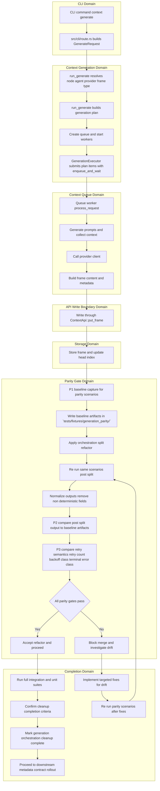

# Command To Parity Flow

```mermaid
flowchart TD
    subgraph CLI["CLI Domain"]
        A["CLI command context generate"]
        B["src/cli/route.rs builds GenerateRequest"]
    end

    subgraph GEN["Context Generation Domain"]
        C["run_generate resolves node agent provider frame type"]
        D["run_generate builds generation plan"]
        E["Create queue and start workers"]
        F["GenerationExecutor submits plan items with enqueue_and_wait"]
    end

    subgraph QUEUE["Context Queue Domain"]
        G["Queue worker process_request"]
        H["Generate prompts and collect context"]
        I["Call provider client"]
        J["Build frame content and metadata"]
    end

    subgraph API["API Write Boundary Domain"]
        K["Write through ContextApi::put_frame"]
    end

    subgraph STORE["Storage Domain"]
        L["Store frame and update head index"]
    end

    subgraph PARITY["Parity Gate Domain"]
        M["P1 baseline capture for parity scenarios"]
        N["Write baseline artifacts in `tests/fixtures/generation_parity/`"]
        O["Apply orchestration split refactor"]
        P["Re run same scenarios post split"]
        Q["Normalize outputs remove non deterministic fields"]
        R["P2 compare post split output to baseline artifacts"]
        S["P3 compare retry semantics retry count backoff class terminal error class"]
        T{"All parity gates pass"}
        U["Accept refactor and proceed"]
        V["Block merge and investigate drift"]
    end

    subgraph COMPLETE["Completion Domain"]
        W["Implement targeted fixes for drift"]
        X["Re run parity scenarios after fixes"]
        Y["Run full integration and unit suites"]
        Z["Confirm cleanup completion criteria"]
        AA["Mark generation orchestration cleanup complete"]
        AB["Proceed to downstream metadata contract rollout"]
    end

    A --> B
    B --> C
    C --> D
    D --> E
    E --> F
    F --> G
    G --> H
    H --> I
    I --> J
    J --> K
    K --> L
    L --> M
    M --> N
    N --> O
    O --> P
    P --> Q
    Q --> R
    R --> S
    S --> T
    T -->|Yes| U
    T -->|No| V
    U --> Y
    V --> W
    W --> X
    X --> P
    Y --> Z
    Z --> AA
    AA --> AB
```
